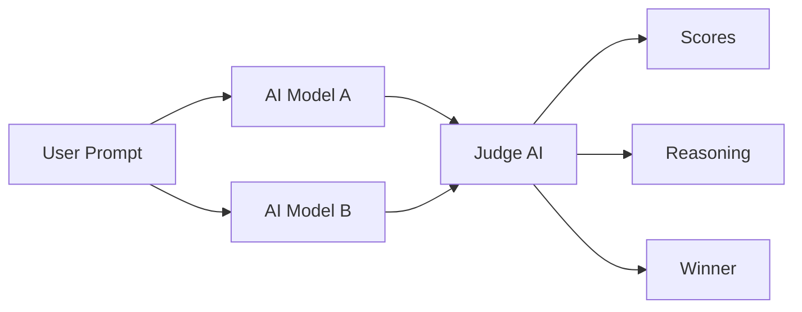
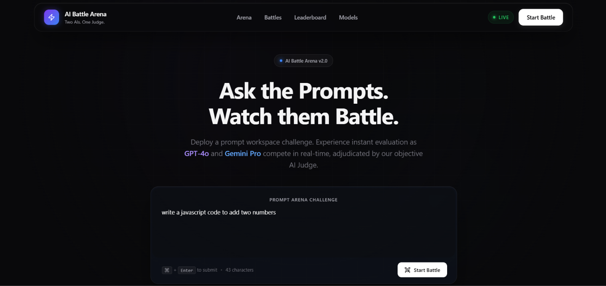
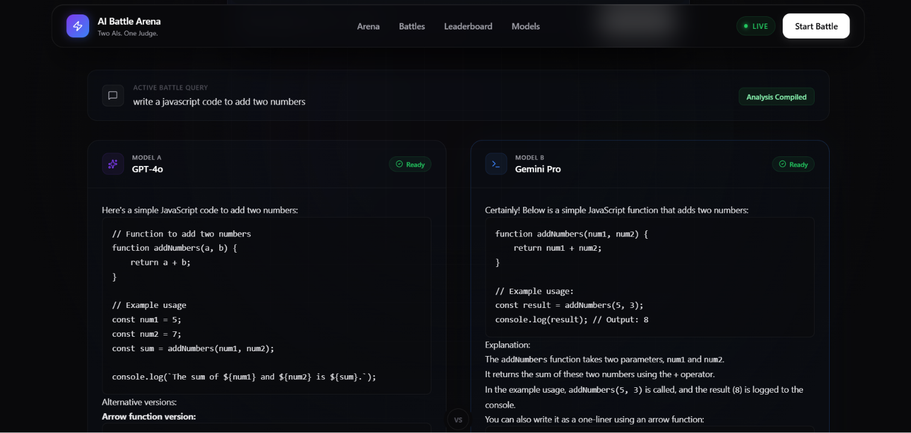
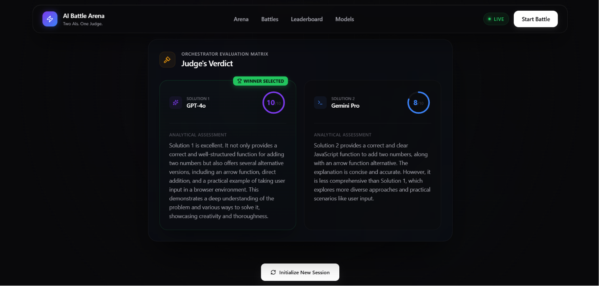

# 🤖 AI Battle Arena

<p align="center">

**Multi-LLM Comparison Platform where two AI models compete and a Judge AI evaluates the winner.**

[](https://ai-battle-arena-vz1h.onrender.com)
[]()
[]()
[]()
[]()

</p>

## 🚀 Live Demo

- **Website:** https://ai-battle-arena-vz1h.onrender.com
- **Repository:** https://github.com/Lokesh-coder-tech/Ai-Battle-Arena

---

# 📖 Overview

AI Battle Arena lets users submit a prompt to **two AI models simultaneously**. Their responses are sent to a **Judge AI**, which compares quality, assigns scores, explains its reasoning, and declares the winner.

---

# ✨ Features

- 🤖 Dual AI battle
- ⚖️ Independent Judge AI
- 🏆 Winner declaration
- 📊 Score comparison
- 💡 Reasoning generated by Judge
- ⚡ Fast full-stack architecture
- 🌐 Responsive React UI
- 🧩 Modular backend
- ☁️ Render deployment

---

# 🛠 Tech Stack

| Layer | Technology |
|-------|------------|
| Frontend | React + Vite + CSS |
| Backend | Node.js + Express + TypeScript |
| Database | MongoDB |
| AI | LangChain + LangGraph + Mistral + Cohere + Gemini |
| Deployment | Render |

> Note: The frontend labels use GPT‑4o, Gemini Pro and Grok for demonstration, while the backend currently integrates Mistral, Cohere and Gemini.

---

# 🏗 Folder Structure

```text
AI-Battle-Arena/
│
├── Backend/
│   ├── api/
│   ├── public/
│   ├── src/
│   ├── server.ts
│   ├── package.json
│   └── tsconfig.json
│
├── Frontend/
│   ├── src/
│   ├── public/
│   ├── package.json
│   └── vite.config.js
│
└── README.md
```

# 🔄 Workflow



# 📡 API

## GET

Returns service information.

## POST `/invoke`

Accepts a prompt, invokes both models, evaluates responses, and returns:

- Response A
- Response B
- Scores
- Judge reasoning
- Winner

---

# ⚙️ Installation

```bash
git clone https://github.com/Lokesh-coder-tech/Ai-Battle-Arena.git
cd Ai-Battle-Arena
```

Backend

```bash
cd Backend
npm install
npm run dev
```

Frontend

```bash
cd Frontend
npm install
npm run dev
```

---

# 🔑 Environment Variables

```env
PORT=3000

MISTRAL_API_KEY=YOUR_KEY
COHERE_API_KEY=YOUR_KEY
GOOGLE_API_KEY=YOUR_KEY
```

> Replace the placeholder values with your own API keys before running the project.

---

## 📸 Screenshots

### Home Page


### Battle Page


### Result Page


---

# 🚀 Future Improvements

- Authentication
- Battle history
- Leaderboard
- Export to PDF
- More LLM providers
- Token usage analytics
- Cost comparison
- Streaming responses

---

# 🤝 Contributing

Contributions are welcome.

1. Fork
2. Create a branch
3. Commit
4. Push
5. Open a Pull Request

---

# 👨‍💻 Author

**Lokesh Sharma**

- GitHub: https://github.com/Lokesh-coder-tech
- LinkedIn: www.linkedin.com/in/lokeshsharma-dev

---

# ⭐ Support

If you like this project, please **star the repository**.

---

# 📄 License

MIT License.

---

<p align="center">
Built with ❤️ by <b>Lokesh Sharma</b>
</p>
