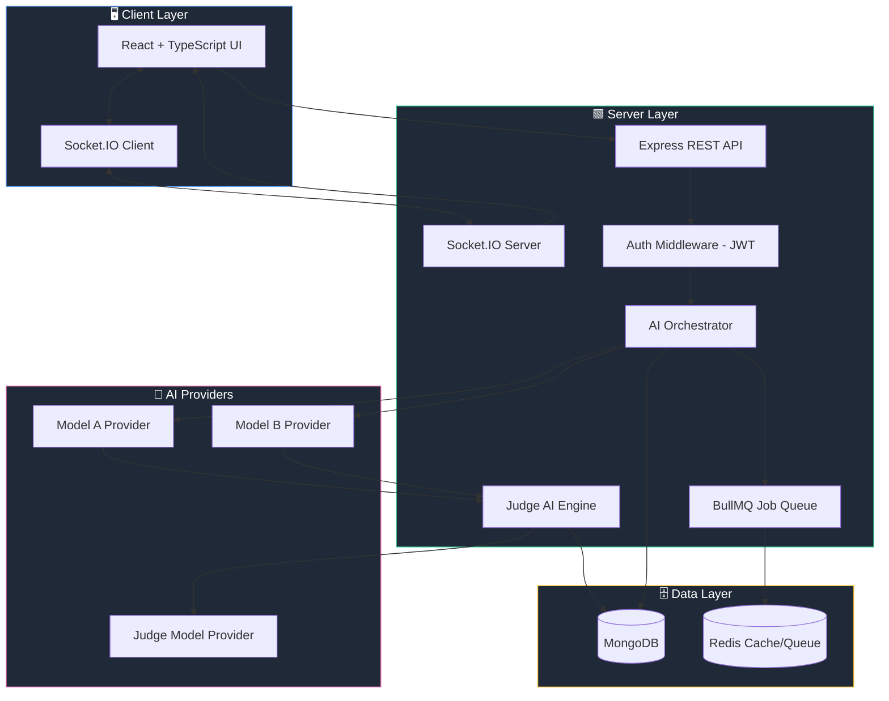
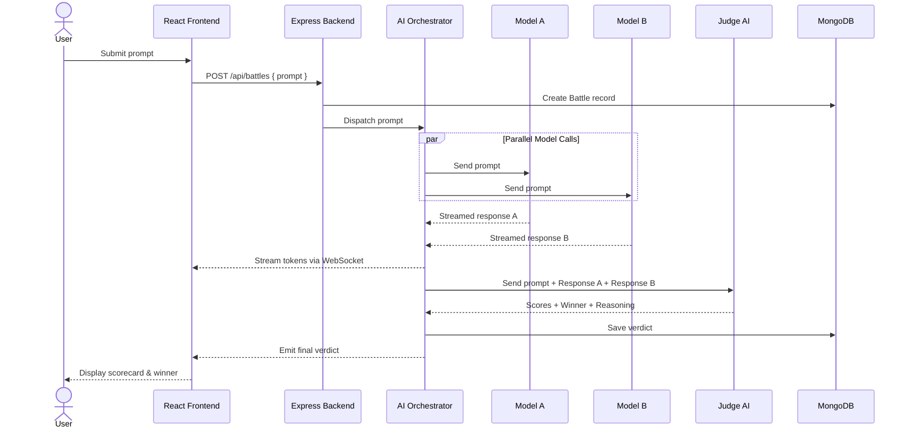
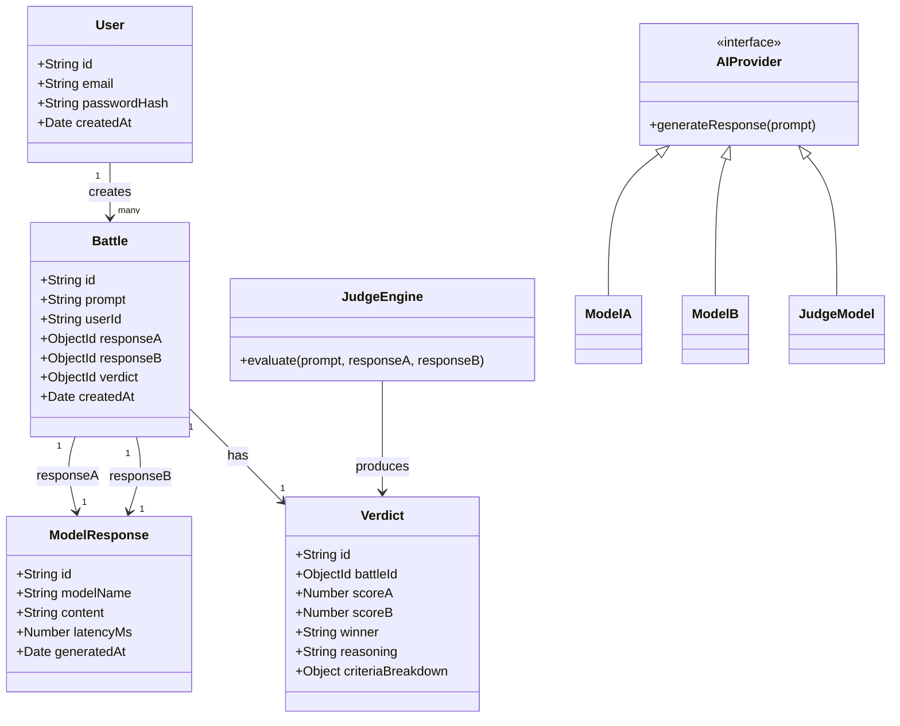

<div align="center">

# ⚔️ AI Battle Arena

### Two AIs. One Prompt. A Judge to Decide the Winner.

**A full-stack platform where AI models compete head-to-head, and a third AI judges the results — impartially, transparently, and with reasoning you can actually read.**

[](https://github.com/TODO-username/ai-battle-arena/stargazers)
[](https://github.com/TODO-username/ai-battle-arena/network/members)
[](./LICENSE)
[](https://github.com/TODO-username/ai-battle-arena/issues)
[](./CONTRIBUTING.md)

[](https://www.typescriptlang.org/)
[](https://nodejs.org/)
[](https://react.dev/)
[](https://expressjs.com/)
[](https://www.mongodb.com/)
[](https://www.docker.com/)

[🚀 Live Demo](https://TODO-live-demo-link.com) · [📖 Documentation](#-table-of-contents) · [🐛 Report Bug](https://github.com/TODO-username/ai-battle-arena/issues) · [✨ Request Feature](https://github.com/TODO-username/ai-battle-arena/issues)

</div>

<br/>

<div align="center">
  
  <br/>
  <em>TODO: Replace with actual hero banner/screenshot of the Arena in action</em>
</div>

<br/>

---

## 📚 Table of Contents

<details>
<summary>Click to expand</summary>

1. [Overview](#-overview)
2. [Key Features](#-key-features)
3. [Architecture Overview](#-architecture-overview)
4. [How It Works — The Full Workflow](#-how-it-works--the-full-workflow)
5. [Tech Stack](#-tech-stack)
6. [Folder Structure](#-folder-structure)
7. [Screenshots](#-screenshots)
8. [Demo](#-demo)
9. [Installation](#-installation)
10. [Environment Variables](#-environment-variables)
11. [Running Locally](#-running-locally)
12. [API Documentation](#-api-documentation)
13. [System Architecture Diagram](#-system-architecture-diagram)
14. [Sequence Diagram — A Battle Round](#-sequence-diagram--a-battle-round)
15. [Component Relationship Diagram](#-component-relationship-diagram)
16. [The AI Workflow](#-the-ai-workflow)
17. [Meet the Judge AI](#-meet-the-judge-ai)
18. [Why This Project Is Unique](#-why-this-project-is-unique)
19. [Challenges Solved While Building](#-challenges-solved-while-building)
20. [Future Improvements](#-future-improvements)
21. [Performance Optimizations](#-performance-optimizations)
22. [Security Considerations](#-security-considerations)
23. [Deployment](#-deployment)
24. [Contributing](#-contributing)
25. [License](#-license)
26. [Acknowledgements](#-acknowledgements)
27. [Author](#-author)
28. [Support](#-support)
29. [Star This Repository](#-star-this-repository)
30. [FAQ](#-faq)
31. [Roadmap](#-roadmap)
32. [Project Statistics](#-project-statistics)

</details>

---

## 🧠 Overview

**AI Battle Arena** is a full-stack platform that turns AI model comparison into a spectacle. Instead of blindly trusting benchmark leaderboards, you submit **one prompt**, watch **two competing AI models** respond in real time, and let a **neutral Judge AI** score both answers across multiple dimensions — accuracy, clarity, creativity, and reasoning depth — before declaring a winner with a full written verdict.

It's part **developer tool**, part **AI benchmarking sandbox**, and part **genuinely fun experience** for anyone curious about how different models "think" differently when faced with the exact same question.

Whether you're an engineer evaluating which LLM fits your use case, a researcher studying model behavior, or just someone who enjoys watching GPT-style and open-weight models duke it out — **AI Battle Arena makes AI comparison visual, transparent, and explainable.**

> 💡 **The core idea:** Don't just compare outputs. Compare them *with a reason attached.*

---

## ✨ Key Features

| Feature | Description |
|---|---|
| ⚔️ **Head-to-Head Battles** | Submit any prompt and watch two AI models respond simultaneously. |
| ⚖️ **Impartial Judge AI** | A dedicated third model evaluates both responses and renders a transparent verdict. |
| 🧾 **Explainable Scoring** | The Judge doesn't just pick a winner — it explains *why*, criterion by criterion. |
| 🔄 **Model-Agnostic Design** | Plug in different LLM providers/models without rewriting the core engine. |
| 📊 **Score Breakdown Dashboard** | Visual radar/bar charts showing how each model performed across categories. |
| 🕓 **Battle History** | Every battle is logged and revisitable — build your own leaderboard over time. |
| 🔐 **Secure Auth & Sessions** | JWT-based authentication protects user battles and history. |
| 🌗 **Modern, Responsive UI** | Clean React interface with dark-mode-first design. |
| ⚡ **Real-Time Streaming** | Responses stream token-by-token so battles feel alive, not static. |
| 🧩 **Extensible Judge Criteria** | Customize what the Judge AI scores on — accuracy, tone, creativity, and more. |

---

## 🏗️ Architecture Overview

AI Battle Arena follows a **decoupled client-server architecture** with an **AI orchestration layer** sitting between the backend and multiple LLM providers.

- **Frontend (React + TypeScript):** Handles prompt submission, live response streaming, score visualization, and battle history.
- **Backend (Node.js + Express + TypeScript):** Orchestrates battles, manages auth, persists data, and exposes a REST API.
- **AI Orchestration Layer:** A dedicated service module that fans a single prompt out to two competitor models, then routes both responses to the Judge AI.
- **Database (MongoDB):** Stores users, battles, responses, and judge verdicts as structured documents.
- **Job Queue (optional, for scale):** Handles concurrent battle requests without blocking the API.

This separation means any individual piece — the UI, the orchestration logic, or the model providers — can evolve independently.

---

## 🔄 How It Works — The Full Workflow

1. **User submits a prompt** through the Arena UI (e.g., *"Explain quantum entanglement to a 10-year-old"*).
2. The **backend receives the request** and creates a new `Battle` record.
3. The **Orchestration Layer** dispatches the prompt **in parallel** to **Model A** and **Model B**.
4. Both models generate responses, which are **streamed back to the frontend** in real time.
5. Once both responses are complete, they are packaged together with the original prompt and sent to the **Judge AI**.
6. The **Judge AI evaluates** both responses against a defined rubric (accuracy, clarity, depth, creativity, helpfulness).
7. The Judge returns a **structured verdict**: per-criterion scores, an overall winner, and a written explanation.
8. The **verdict is persisted** to the database and rendered on the frontend as an interactive scorecard.
9. The completed battle is added to the user's **Battle History**, viewable and shareable at any time.

---

## 🛠️ Tech Stack

<table>
<tr>
<td valign="top" width="50%">

### Frontend
- ⚛️ React + TypeScript
- 🎨 TailwindCSS
- 🔄 React Query
- 📊 Recharts / Chart.js (score visualizations)
- 🌐 Socket.IO Client (real-time streaming)

</td>
<td valign="top" width="50%">

### Backend
- 🟩 Node.js + Express
- 🔷 TypeScript
- 🔌 Socket.IO (WebSocket streaming)
- 🔐 JWT Authentication
- 🧵 BullMQ (job queue for concurrent battles)

</td>
</tr>
<tr>
<td valign="top" width="50%">

### AI Layer
- 🤖 OpenAI API (TODO: specify models used)
- 🤖 Anthropic Claude API (TODO: specify models used)
- 🤖 TODO: Additional provider (e.g., Google Gemini / Groq / open-weight models)
- 🧑‍⚖️ Dedicated Judge AI prompt pipeline

</td>
<td valign="top" width="50%">

### Database & Infra
- 🍃 MongoDB + Mongoose
- 🐳 Docker & Docker Compose
- ☁️ TODO: Deployment target (Vercel / Render / AWS / Railway)
- 📦 Redis (caching & queue backing store)

</td>
</tr>
</table>

### Tooling

| Category | Tools |
|---|---|
| Testing | Jest, Supertest, React Testing Library |
| Linting/Formatting | ESLint, Prettier, Husky |
| CI/CD | GitHub Actions |
| API Docs | Swagger / OpenAPI (TODO: link) |
| Monitoring | TODO: Sentry / LogRocket |

---

## 📁 Folder Structure

```
ai-battle-arena/
├── client/                        # React + TypeScript frontend
│   ├── public/
│   ├── src/
│   │   ├── assets/
│   │   ├── components/
│   │   │   ├── Arena/             # Battle input & live response panels
│   │   │   ├── Judge/             # Scorecard & verdict UI
│   │   │   ├── History/           # Battle history list & details
│   │   │   └── common/            # Shared UI components
│   │   ├── hooks/
│   │   ├── pages/
│   │   ├── services/               # API client, socket client
│   │   ├── store/                  # State management
│   │   ├── types/
│   │   └── App.tsx
│   └── package.json
│
├── server/                        # Node.js + Express backend
│   ├── src/
│   │   ├── ai/
│   │   │   ├── providers/          # Model A / Model B provider adapters
│   │   │   ├── judge/              # Judge AI prompt + evaluation logic
│   │   │   └── orchestrator.ts     # Fans prompt out, collects results
│   │   ├── config/
│   │   ├── controllers/
│   │   ├── middlewares/
│   │   ├── models/                 # Mongoose schemas (User, Battle, Verdict)
│   │   ├── routes/
│   │   ├── services/
│   │   ├── sockets/
│   │   ├── utils/
│   │   └── server.ts
│   └── package.json
│
├── docs/
│   ├── screenshots/
│   └── diagrams/
│
├── docker-compose.yml
├── .env.example
├── LICENSE
└── README.md
```

---

## 📸 Screenshots

<div align="center">

| Battle Arena — Live View | Judge AI Verdict Screen |
|---|---|
|  |  |

| Battle History | Score Breakdown Dashboard |
|---|---|
|  |  |

</div>

> 🖼️ TODO: Replace all placeholder images in `docs/screenshots/` with actual application screenshots.

---

## 🎬 Demo

<div align="center">


*TODO: Insert a real demo GIF showing a full battle from prompt submission to verdict.*

🔗 **Live Website:** [https://TODO-live-demo-link.com](https://TODO-live-demo-link.com)
🎥 **Video Walkthrough:** [TODO: YouTube/Loom link]

</div>

---

## ⚙️ Installation

### Prerequisites

- Node.js `>= 18.x`
- npm or yarn
- MongoDB instance (local or Atlas)
- Redis instance (for queue support)
- API keys for chosen AI providers

### Clone the Repository

```bash
git clone https://github.com/TODO-username/ai-battle-arena.git
cd ai-battle-arena
```

### Install Dependencies

```bash
# Install root/server dependencies
cd server
npm install

# Install client dependencies
cd ../client
npm install
```

---

## 🔑 Environment Variables

Create a `.env` file inside the `server/` directory based on `.env.example`:

```env
# Server
PORT=5000
NODE_ENV=development

# Database
MONGO_URI=mongodb://localhost:27017/ai-battle-arena
REDIS_URL=redis://localhost:6379

# Authentication
JWT_SECRET=TODO_your_jwt_secret
JWT_EXPIRES_IN=7d

# AI Providers
OPENAI_API_KEY=TODO_your_openai_key
ANTHROPIC_API_KEY=TODO_your_anthropic_key
JUDGE_MODEL_PROVIDER=TODO_provider_name
JUDGE_MODEL_NAME=TODO_model_name

# Client
CLIENT_URL=http://localhost:3000
```

Create a `.env` file inside the `client/` directory:

```env
VITE_API_BASE_URL=http://localhost:5000/api
VITE_SOCKET_URL=http://localhost:5000
```

> ⚠️ Never commit real `.env` files. `.env.example` files are provided for reference only.

---

## ▶️ Running Locally

```bash
# Terminal 1 — Start the backend
cd server
npm run dev

# Terminal 2 — Start the frontend
cd client
npm run dev
```

Or, using Docker Compose:

```bash
docker-compose up --build
```

The app will be available at:
- Frontend: `http://localhost:3000`
- Backend API: `http://localhost:5000/api`

---

## 📡 API Documentation

<details>
<summary><strong>🔐 Auth Routes</strong></summary>

| Method | Endpoint | Description |
|---|---|---|
| `POST` | `/api/auth/register` | Register a new user |
| `POST` | `/api/auth/login` | Log in and receive a JWT |
| `POST` | `/api/auth/logout` | Invalidate current session |
| `GET`  | `/api/auth/me` | Get current authenticated user |

</details>

<details>
<summary><strong>⚔️ Battle Routes</strong></summary>

| Method | Endpoint | Description |
|---|---|---|
| `POST` | `/api/battles` | Create a new battle (submit prompt) |
| `GET`  | `/api/battles` | Get all battles for the current user |
| `GET`  | `/api/battles/:id` | Get details of a specific battle |
| `DELETE` | `/api/battles/:id` | Delete a battle from history |

</details>

<details>
<summary><strong>🧑‍⚖️ Judge Routes</strong></summary>

| Method | Endpoint | Description |
|---|---|---|
| `POST` | `/api/battles/:id/judge` | Trigger judge evaluation for a completed battle |
| `GET`  | `/api/battles/:id/verdict` | Retrieve the judge's verdict for a battle |

</details>

<details>
<summary><strong>📊 Stats Routes</strong></summary>

| Method | Endpoint | Description |
|---|---|---|
| `GET`  | `/api/stats/leaderboard` | Get win/loss stats across models |
| `GET`  | `/api/stats/user` | Get battle statistics for the current user |

</details>

> 📘 Full interactive API docs: TODO — link Swagger/Postman collection here.

---

## 🗺️ System Architecture Diagram



---

## 🔁 Sequence Diagram — A Battle Round



---

## 🧩 Component Relationship Diagram



---

## 🧬 The AI Workflow

The AI orchestration pipeline is intentionally **provider-agnostic**. Every model — whether it's competing or judging — implements a common `AIProvider` interface with a single core method: `generateResponse(prompt)`. This means:

- Swapping **Model A** or **Model B** for a different provider requires **zero changes** to the orchestration logic.
- Adding a **new competitor model** is as simple as writing a new adapter.
- The **Judge AI** is just another provider — but one invoked with a specialized evaluation prompt instead of a raw user prompt.

**Pipeline stages:**

1. **Fan-out:** The same prompt is sent concurrently to both competitor models to eliminate any timing bias.
2. **Streaming collection:** Responses are streamed and buffered independently, so a slow model never blocks the other.
3. **Normalization:** Both completed responses are normalized (trimmed, formatted) before being handed to the Judge.
4. **Evaluation:** The Judge AI receives a structured prompt containing the original question and both anonymized responses (labeled "Response A" / "Response B" to reduce bias toward provider names).
5. **Verdict parsing:** The Judge's structured output (JSON) is validated and parsed into a `Verdict` document.
6. **Persistence & broadcast:** The verdict is saved and pushed to the client via WebSocket.

---

## 🧑‍⚖️ Meet the Judge AI

The Judge AI is the heart of what makes AI Battle Arena different from a simple side-by-side comparison tool.

**Design principles behind the Judge:**

- ⚖️ **Impartiality by design** — Responses are anonymized (Response A / Response B) before reaching the Judge, so model identity never influences scoring.
- 🧾 **Structured rubric** — The Judge scores each response against explicit criteria: **Accuracy**, **Clarity**, **Depth of Reasoning**, **Creativity**, and **Helpfulness**.
- 💬 **Explainability first** — Every verdict includes a written justification, not just a numeric score. Users can see *exactly* why one response won.
- 🔁 **Deterministic output format** — The Judge is prompted to return strict JSON, which is validated before being trusted and stored.
- 🧠 **Configurable weighting** — Criteria weights can be tuned (TODO: expose via settings UI) to bias the Judge toward, say, creativity over strict factual accuracy.

**Example (simplified) Judge output shape:**

```json
{
  "winner": "Response A",
  "scores": {
    "responseA": { "accuracy": 9, "clarity": 8, "depth": 8, "creativity": 7, "helpfulness": 9 },
    "responseB": { "accuracy": 7, "clarity": 9, "depth": 6, "creativity": 8, "helpfulness": 7 }
  },
  "reasoning": "Response A provided a more technically accurate explanation while remaining accessible..."
}
```

---

## 🌟 Why This Project Is Unique

- 🚫 **Not just another chatbot wrapper.** AI Battle Arena is built around comparative evaluation, not single-model conversation.
- 🔍 **Transparency over blind trust.** Every verdict comes with reasoning — no "black box" winner declarations.
- 🧱 **Architected for extensibility.** Adding new models or new judging criteria doesn't require touching core logic.
- 📈 **Turns AI evaluation into data.** Battle history becomes a personal, evolving leaderboard of model performance.
- 🎮 **Genuinely engaging UX.** It reframes model benchmarking as something interactive and fun, not a spreadsheet of numbers.

---

## 🧗 Challenges Solved While Building

<details>
<summary><strong>⚡ Handling concurrent, independent AI streams</strong></summary>

Streaming two model responses simultaneously without one blocking the other required decoupling each provider call into independent async streams merged safely on the frontend via WebSocket events tagged by model slot (`A` / `B`).
</details>

<details>
<summary><strong>⚖️ Eliminating bias in the Judge AI</strong></summary>

Early prototypes leaked model identity into the Judge's context, causing brand bias. The fix: strict anonymization — responses are relabeled "Response A/B" and provider metadata is stripped before the Judge ever sees them.
</details>

<details>
<summary><strong>🧾 Getting reliable structured output from the Judge</strong></summary>

LLMs don't always return clean JSON. A validation + retry layer re-prompts the Judge with corrective instructions if its output fails schema validation, ensuring the verdict is always parseable.
</details>

<details>
<summary><strong>🚦 Managing rate limits across multiple AI providers</strong></summary>

A queue-based throttling layer (BullMQ + Redis) smooths out bursts of concurrent battles so provider rate limits are respected without failing user requests.
</details>

---

## 🔮 Future Improvements

- 🏆 Public global leaderboard across all users' battles
- 🧑‍🤝‍🧑 Multi-model battles (3+ competitors at once)
- 🗳️ Community voting alongside Judge AI verdicts
- 🧠 Support for local/open-weight models via Ollama
- 📱 Native mobile app
- 🔗 Shareable battle result links with OG image previews
- 🧮 Configurable judging rubrics per battle

---

## 🚀 Performance Optimizations

- ⚡ **Parallel model dispatch** — both competitors are queried concurrently, not sequentially.
- 📦 **Response streaming** — tokens are streamed to the client instead of waiting for full completions.
- 🧵 **Queue-based concurrency control** — prevents provider rate-limit failures under load.
- 🗄️ **Indexed MongoDB queries** — battle history and leaderboard queries use compound indexes on `userId` and `createdAt`.
- 🧊 **Redis caching** — frequently accessed leaderboard/stat aggregates are cached with short TTLs.
- 🎯 **Code-splitting on the frontend** — route-level lazy loading keeps initial bundle size minimal.

---

## 🔒 Security Considerations

- 🔐 **JWT-based authentication** with short-lived access tokens and httpOnly refresh tokens.
- 🧂 **Password hashing** via bcrypt with adequate salt rounds.
- 🛡️ **Input validation & sanitization** on all API routes to prevent injection attacks.
- 🚫 **Rate limiting** on auth and battle-creation endpoints to prevent abuse.
- 🔑 **API keys never exposed client-side** — all AI provider calls are proxied through the backend.
- 🌐 **CORS locked down** to known client origins in production.
- 📝 **Structured error handling** that avoids leaking stack traces or internal details to clients.

---

## ☁️ Deployment

<details>
<summary><strong>Frontend Deployment (TODO: Vercel/Netlify)</strong></summary>

```bash
cd client
npm run build
# Deploy the `dist/` folder to TODO-platform
```
</details>

<details>
<summary><strong>Backend Deployment (TODO: Render/Railway/AWS)</strong></summary>

```bash
cd server
npm run build
npm start
```

Ensure all production environment variables are configured on your hosting platform.
</details>

<details>
<summary><strong>Docker Deployment</strong></summary>

```bash
docker-compose -f docker-compose.prod.yml up --build -d
```
</details>

---

## 🤝 Contributing

Contributions are what make the open-source community such an amazing place to learn, inspire, and create. Any contributions you make are **greatly appreciated**.

1. Fork the repository
2. Create your feature branch: `git checkout -b feature/AmazingFeature`
3. Commit your changes: `git commit -m 'Add some AmazingFeature'`
4. Push to the branch: `git push origin feature/AmazingFeature`
5. Open a Pull Request

Please read [`CONTRIBUTING.md`](./CONTRIBUTING.md) (TODO: create this file) for our code of conduct and PR process.

---

## 📄 License

This project is licensed under the **MIT License** — see the [LICENSE](./LICENSE) file for details.

---

## 🙏 Acknowledgements

- [OpenAI](https://openai.com/) & [Anthropic](https://www.anthropic.com/) for their APIs powering the competing and judging models
- [Shields.io](https://shields.io/) for the badges used in this README
- [Mermaid](https://mermaid.js.org/) for the diagrams throughout this document
- TODO: Any libraries, tutorials, or individuals who inspired this project

---

## 👤 Author

<div align="center">

**TODO: Your Name**

[](https://TODO-portfolio-link.com)
[](https://linkedin.com/in/TODO)
[](https://github.com/TODO-username)
[](https://x.com/TODO)
[](mailto:TODO@example.com)

</div>

---

## 💬 Support

If you run into issues or have questions:

- 🐛 [Open an issue](https://github.com/TODO-username/ai-battle-arena/issues)
- 💡 [Start a discussion](https://github.com/TODO-username/ai-battle-arena/discussions)
- 📧 Email: TODO@example.com

---

## ⭐ Star This Repository

If you find **AI Battle Arena** interesting or useful, please consider giving it a ⭐ — it helps others discover the project and motivates continued development!

<div align="center">

[](https://star-history.com/#TODO-username/ai-battle-arena&Date)

</div>

---

## ❓ FAQ

<details>
<summary><strong>Which AI models can compete in the Arena?</strong></summary>
<br/>
Any model implementing the <code>AIProvider</code> interface can be plugged in as a competitor. TODO: list currently supported models.
</details>

<details>
<summary><strong>Can the Judge AI be biased toward a specific provider?</strong></summary>
<br/>
No — responses are anonymized as "Response A" and "Response B" before being sent to the Judge, and provider metadata is stripped from its context.
</details>

<details>
<summary><strong>Can I use my own API keys?</strong></summary>
<br/>
Yes. Add your provider API keys to the <code>.env</code> file as described in the <a href="#-environment-variables">Environment Variables</a> section.
</details>

<details>
<summary><strong>Is this project free to self-host?</strong></summary>
<br/>
Yes, AI Battle Arena is open-source under the MIT License. You only pay for your own AI provider API usage.
</details>

<details>
<summary><strong>Does it support streaming responses?</strong></summary>
<br/>
Yes — both competing models stream their responses to the frontend in real time via WebSockets.
</details>

---

## 🗺️ Roadmap

- [x] Core battle engine (prompt → dual response → judge verdict)
- [x] Real-time response streaming via WebSockets
- [x] JWT authentication & user battle history
- [x] Score breakdown visualization dashboard
- [ ] Public global leaderboard
- [ ] Multi-model battles (3+ competitors)
- [ ] Community voting alongside Judge AI
- [ ] Support for local/open-weight models (Ollama)
- [ ] Shareable battle result pages with OG previews
- [ ] Mobile app (React Native)
- [ ] Configurable judging rubrics per battle

---

## 📊 Project Statistics

<div align="center">

| Metric | Value |
|---|---|
| ⭐ Stars | TODO |
| 🍴 Forks | TODO |
| 🐛 Open Issues | TODO |
| 🔀 Merged PRs | TODO |
| 📦 Latest Release | TODO |
| 🧑‍💻 Contributors | TODO |


</div>

---

<div align="center">

### ⚔️ Built for developers who want to *see* the difference, not just read about it.

**If AI Battle Arena inspired or helped you, consider ⭐ starring the repo and sharing it with others.**

Made with 🧠 + ☕ by [TODO: Your Name](https://github.com/TODO-username)

<sub>© 2026 AI Battle Arena. Released under the MIT License.</sub>

</div>
